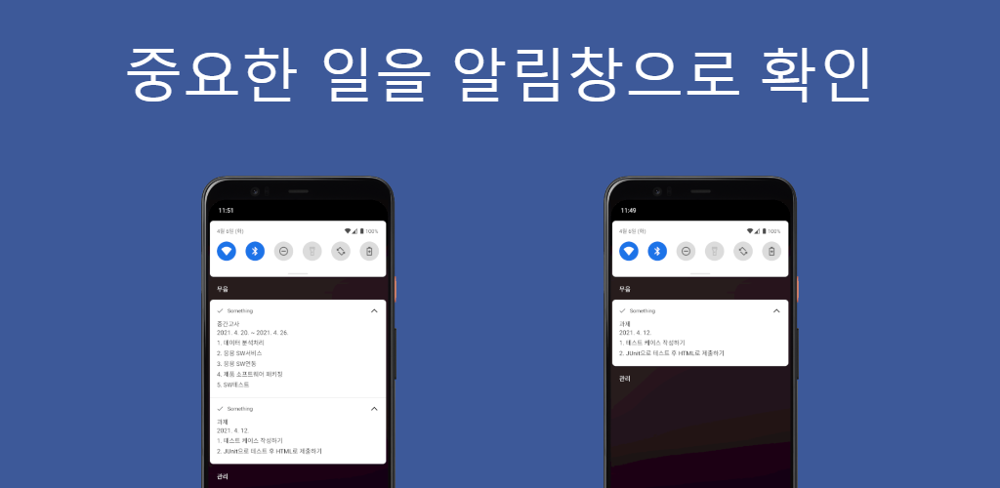

# Something
#### 할 일을 자주 깜빡하는 사람들을을 위한 ToDo 앱입니다.
#### Android ToDo Application for a people who often forgets what to do

## ⚡ Features
#### 핸드폰을 잠금해제시 앱이 자동으로 실행되어 ToDo 목록을 볼 수 있습니다. (설정으로 기능을 On/Off 가능)
#### The app will automatically launch when you unlock your phone, allowing you to check the ToDo list. (Settings allow the function to be turned on/off)

 

#### 중요한 일을 알림창으로 확인할 수 있습니다. (ToDo마다 설정가능)
#### You can check important things in the notification window. (Can be set per ToDo)
