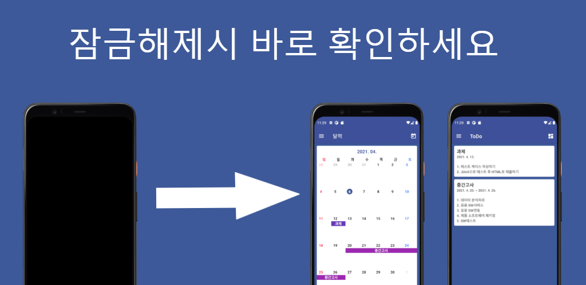

# Something
#### 할 일을 자주 깜빡하는 사람들을을 위한 ToDo 앱입니다.
#### Android ToDo Application for a people who often forgets what to do
https://play.google.com/store/apps/details?id=com.taetae98.something

### ⚡ Features

## 잠금해제시 확인
#### 핸드폰을 잠금해제시 앱이 자동으로 실행되어 ToDo 목록을 확인할 수 있습니다. (설정으로 기능을 On/Off 가능)
#### The app will automatically launch when you unlock your phone, allowing you to check the ToDo list. (Settings allow the function to be turned on/off)

## 알람창으로 확인
#### 중요한 일을 알림창으로 확인할 수 있습니다. (ToDo마다 설정가능)
#### You can check important things in the notification window. (Can be set per ToDo)

## 달력으로 확인
#### 달력으로 한눈에 ToDo 목록을 확인할 수 있습니다.
#### You can check the ToDo list at a glance on your calendar.

## 서랍별로 확인
#### 서랍별로 연관있는 ToDo 목록을 만들 수 있습니다.
#### You can create a list of associated ToDos by drawer.

## 다크모드 지원
#### Blue, Dark 테마를 설정에서 선택할 수 있으며 System 설정에 반응형으로 Theme를 변경할 수 있습니다.
#### You can select the Blue, Dark theme from Settings and change the Theme to System Settings to Reactive.

## 간단하고 깔끔한 UI
#### Jetpack Architecture Navigation과 DrawerLayout을 사용하여 간단하고 깔끔한 UI를 제공하며 UI 대상간 이동에서 Animation을 제공합니다.
#### Use Jetpack Architecture Navigation and Drawer Layout to provide a simple and clean UI and provide animation in the movement between UI targets.
